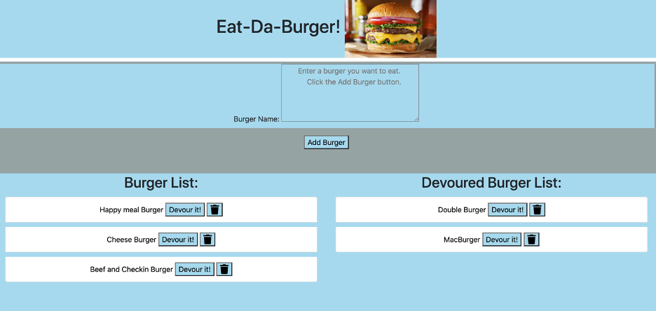

# Node-Express-Handlebars - Eat-Da-Burger! 

[](https://img.shields.io/badge/Project-Node--Handlebars-brightgreen)

[Heroku deployed page is here](https://eat-da-burger-hw13-node-expres.herokuapp.com/)

### Description

This application is a burger logger created with MySQL, Node, Express, Handlebars and a homemade ORM (yum!). It was designed the MVC pattern; Node and MySQL query and route data, and Handlebars generate the HTML.



* Eat-Da-Burger! is a restaurant app that lets users input the names of burgers they'd like to eat.

* Whenever a user submits a burger's name, this app displays the burger on the left side of the page -- waiting to be devoured.

* Each burger in the waiting area also has a `Devour it!` button. When the user clicks it, the burger will move to the right side of the page.

* My app will store every burger in a database, whether devoured or not.

#### Directory structure

All the recommended files and directories from the steps above should look like the following structure:

```
.
├── config
│   ├── connection.js
│   └── orm.js
│ 
├── controllers
│   └── burgers_controller.js
│
├── db
│   ├── schema.sql
│   └── seeds.sql
│
├── models
│   └── burger.js
│ 
├── node_modules
│ 
├── package.json
│
├── public
│   └── assets
│       ├── css
│       │   └── burger_style.css
│       └── img
│       ├   └── burger.png
│       ├   └── burgerScrShot.png
├       ├── js
│       │   └── burger.js
│   
├── server.js
│
└── views
    ├── index.handlebars
    └── layouts
        └── main.handlebars
```
# Enjoy!!!